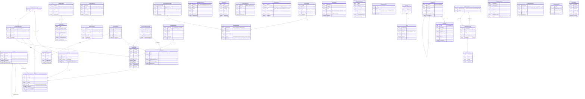

# Mizan Database ERD

## Entity Relationship Diagram

```mermaid
erDiagram
    %% ═══════════════════════════════════════════════
    %% GOVERNMENT HIERARCHY
    %% ═══════════════════════════════════════════════

    officials {
        string nameAr
        string nameEn
        string titleAr
        string titleEn
        string role "president|minister|governor|mp|..."
        boolean isCurrent
        string appointmentDate
        number sanadLevel
    }

    ministries {
        string nameAr
        string nameEn
        string sector "sovereignty|economic|social|infrastructure"
        number sortOrder
        number employeeCount
    }

    governorates {
        string nameAr
        string nameEn
        string capitalAr
        string capitalEn
        number population
        number area
        boolean isCity
        string geoJsonId
        string regionEn
    }

    ministries ||--o| officials : "currentMinisterId"
    ministries ||--o| ministries : "parentMinistryId"
    governorates ||--o| officials : "currentGovernorId"

    %% ═══════════════════════════════════════════════
    %% PARLIAMENT
    %% ═══════════════════════════════════════════════

    parties {
        string nameAr
        string nameEn
        string color
        string abbreviation
        number foundedYear
    }

    parliamentMembers {
        string chamber "house|senate"
        string electionMethod "constituency|party_list|appointed"
        string constituency
        boolean isCurrent
        string termStart
    }

    committees {
        string nameAr
        string nameEn
        string chamber "house|senate"
        string type "standing|special|general|ethics"
    }

    committeeMemberships {
        string role "chair|vice_chair|member"
    }

    parliamentMembers ||--|| officials : "officialId"
    parliamentMembers ||--o| parties : "partyId"
    parliamentMembers ||--o| governorates : "governorateId"
    committees ||--o| officials : "chairpersonId"
    committeeMemberships ||--|| committees : "committeeId"
    committeeMemberships ||--|| parliamentMembers : "memberId"

    %% ═══════════════════════════════════════════════
    %% CONSTITUTION
    %% ═══════════════════════════════════════════════

    constitutionParts {
        number partNumber
        string titleAr
        string titleEn
        number sortOrder
    }

    constitutionArticles {
        number articleNumber
        string textAr
        string textEn
        boolean wasAmended2019
        string keywords "array"
    }

    articleCrossReferences {
        string relationshipType "references|amends|contradicts|elaborates"
        string noteEn
    }

    constitutionArticles ||--|| constitutionParts : "partId"
    articleCrossReferences ||--|| constitutionArticles : "fromArticleId"
    articleCrossReferences ||--|| constitutionArticles : "toArticleId"

    %% ═══════════════════════════════════════════════
    %% BUDGET & SPENDING
    %% ═══════════════════════════════════════════════

    fiscalYears {
        string year "e.g. 2024-2025"
        string startDate
        string endDate
        number totalRevenue
        number totalExpenditure
        number deficit
        number gdp
        number sanadLevel
    }

    budgetItems {
        string category "revenue|expenditure"
        string sectorAr
        string sectorEn
        number amount
        number percentageOfTotal
        number sanadLevel
    }

    budgetItems ||--|| fiscalYears : "fiscalYearId"
    budgetItems ||--o| budgetItems : "parentItemId"

    %% ═══════════════════════════════════════════════
    %% NATIONAL DEBT
    %% ═══════════════════════════════════════════════

    debtRecords {
        string date
        number totalExternalDebt
        number totalDomesticDebt
        number debtToGdpRatio
        number foreignReserves
        number totalDebtService
        number sanadLevel
    }

    debtByCreditor {
        string creditorEn
        string creditorType "multilateral|bilateral|commercial|other"
        number amount
        number interestRate
        number maturityYears
    }

    debtByCreditor ||--|| debtRecords : "debtRecordId"

    %% ═══════════════════════════════════════════════
    %% ELECTIONS
    %% ═══════════════════════════════════════════════

    elections {
        string type "presidential|parliamentary_house|senate|referendum"
        number year
        string dateHeld
        number totalRegisteredVoters
        number turnoutPercentage
        number sanadLevel
    }

    electionResults {
        string candidateNameEn
        number votes
        number percentage
        boolean isWinner
        number sanadLevel
    }

    governorateElectionData {
        number registeredVoters
        number votesCast
        number turnoutPercentage
        string winnerNameEn
        number winnerPercentage
    }

    electionResults ||--|| elections : "electionId"
    electionResults ||--o| parties : "partyId"
    governorateElectionData ||--|| elections : "electionId"
    governorateElectionData ||--|| governorates : "governorateId"

    %% ═══════════════════════════════════════════════
    %% DATA & ECONOMICS
    %% ═══════════════════════════════════════════════

    economicIndicators {
        string indicator "gdp_growth|inflation|unemployment|..."
        string date
        number value
        string unit
        string sourceUrl
        number sanadLevel
    }

    governorateStats {
        string indicator "population|area_km2|hdi|..."
        string year
        number value
        string unit
        string sourceUrl
        number sanadLevel
    }

    governorateStats ||--|| governorates : "governorateId"

    taxBrackets {
        string year
        number fromAmount
        number toAmount
        number rate
        number sortOrder
        number sanadLevel
    }

    sovereignRatings {
        string agency "S_and_P|Moodys|Fitch"
        string rating
        string outlook
        string effectiveDate
        number sanadLevel
    }

    dataSources {
        string nameEn
        string url
        string type "official_government|international_org|media|..."
        string lastAccessedDate
        string category
        number sanadLevel
    }

    %% ═══════════════════════════════════════════════
    %% AI PIPELINE & AUDIT
    %% ═══════════════════════════════════════════════

    dataRefreshLog {
        string category
        string status "success|failed|in_progress"
        number recordsUpdated
        number startedAt
        number completedAt
    }

    dataChangeLog {
        string category
        string action "created|updated|validated|flagged"
        string tableName
        string descriptionEn
        number timestamp
    }

    dataChangeLog ||--|| dataRefreshLog : "refreshLogId"

    dataLineage {
        string tableName
        string fieldName
        string value
        string sourceType "direct|calculated|ai_extracted|manual"
        string confidence "high|medium|low"
        boolean aiVerified
    }

    aiResearchReports {
        string titleEn
        string category
        string summaryEn
        string contentEn
        number findingsCount
        number discrepanciesFound
        string agentModel
    }

    pipelineProgress {
        string runId
        string step
        string status "pending|running|success|failed|skipped"
        string message
    }

    %% ═══════════════════════════════════════════════
    %% LLM COUNCIL
    %% ═══════════════════════════════════════════════

    councilSessions {
        string triggerType "github_issue|data_refresh|manual"
        string category
        string tableName
        string proposedValue
        string status "pending|approved|rejected|needs_human_review"
        number createdAt
    }

    councilVotes {
        string model
        string provider
        string vote "approve|reject|abstain"
        string confidence "high|medium|low"
        string reasoning
    }

    councilVotes ||--|| councilSessions : "sessionId"

    githubIssueProcessing {
        number issueNumber
        string issueType "data|ui|unknown"
        string status "queued|processing|approved|rejected|spam"
        string authorUsername
        number createdAt
    }

    githubIssueProcessing ||--o| councilSessions : "councilSessionId"

    %% ═══════════════════════════════════════════════
    %% POLLS
    %% ═══════════════════════════════════════════════

    polls {
        string questionEn
        string category
        string options "array of labelEn + votes"
        number totalVotes
        boolean isActive
        number expiresAt
    }

    pollVotes {
        number optionIndex
        string visitorHash
        number votedAt
    }

    pollVotes ||--|| polls : "pollId"

    %% ═══════════════════════════════════════════════
    %% FUNDING
    %% ═══════════════════════════════════════════════

    fundingDonations {
        string donorName
        boolean isAnonymous
        number amount
        string currency
        number amountUsd
        string paymentProvider
        string status "pending|confirmed|refunded"
    }

    fundingAllocations {
        string categoryEn
        string category "infrastructure|ai_api_costs|development|..."
        number amountUsd
        string descriptionEn
        boolean isRecurring
    }

    fundingSummary {
        string month
        number totalDonationsUsd
        number totalAllocatedUsd
        number balanceUsd
    }

    apiUsageLog {
        string provider
        string model
        string purpose
        number totalTokens
        number costUsd
        boolean success
    }
```
